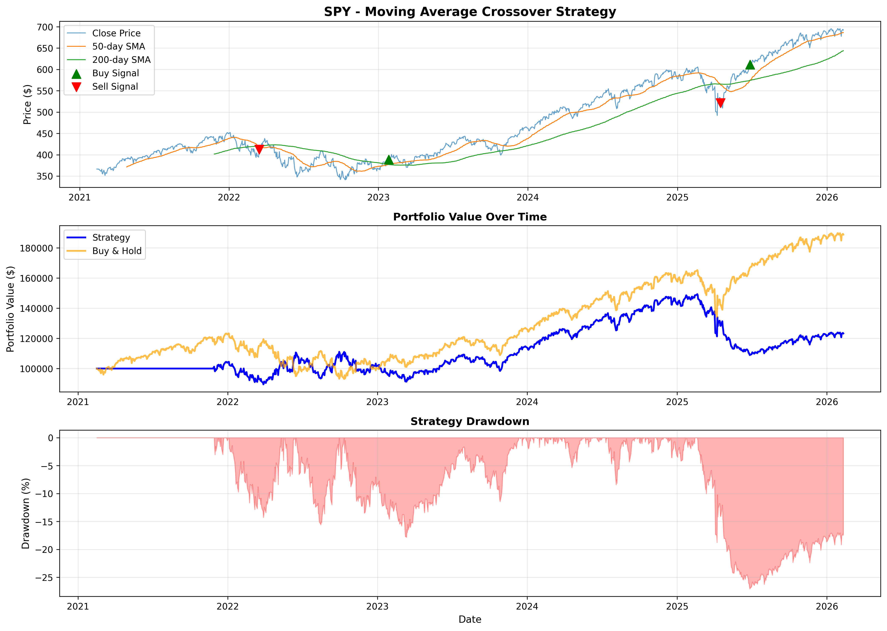

# SPY Moving Average Crossover Trading Strategy

## Overview
A quantitative trading strategy that uses moving average crossovers to generate buy and sell signals on the S&P 500 ETF (SPY). Built in Python with full backtesting capabilities, performance metrics, and data visualization.

## Strategy Logic
- **Buy Signal:** When the 50-day Simple Moving Average (SMA) crosses **above** the 200-day SMA (Golden Cross)
- **Sell Signal:** When the 50-day SMA crosses **below** the 200-day SMA (Death Cross)

## Backtest Results (2021-2026)
| Metric | Strategy | Buy & Hold |
|--------|----------|------------|
| Total Return | 23.29% | 88.84% |
| Annual Return | 4.28% | 13.57% |
| Sharpe Ratio | 0.34 | 0.83 |
| Maximum Drawdown | -27.07% | - |
| Number of Trades | 6 | - |
| Final Portfolio Value | $123,294 | $188,835 |

**Initial Capital:** $100,000

## Key Findings
- The strategy successfully avoided significant drawdowns during the 2022 market correction by generating a sell signal before the major decline
- Buy & Hold outperformed in this bull market period, which is expected for momentum-based strategies in trending markets
- The low number of trades (6) minimizes transaction costs and slippage
- The strategy demonstrates stronger risk management characteristics with reduced volatility compared to passive investing

## Performance Charts


## Technologies Used
- **Python 3.9**
- **pandas** - Data manipulation and analysis
- **NumPy** - Numerical computations
- **yfinance** - Yahoo Finance market data API
- **Matplotlib** - Data visualization

## Installation & Usage

### Prerequisites
```bash
python3 -m pip install yfinance pandas numpy matplotlib
```

### Run the Backtest
```bash
python3 trading_strategy.py
```

### Customize the Strategy
```python
strategy = MovingAverageCrossover(
    ticker='AAPL',        # Change to any stock ticker
    short_window=50,      # Adjust short moving average period
    long_window=200,      # Adjust long moving average period
    initial_capital=50000 # Set your starting capital
)
```

## Project Structure
```
trading-strategy/
│
├── trading_strategy.py      # Main strategy and backtesting code
├── strategy_performance.png # Performance visualization output
└── README.md                # Project documentation
```

## Future Improvements
- Add transaction cost modeling
- Implement additional technical indicators (RSI, MACD, Bollinger Bands)
- Optimize moving average windows using walk-forward analysis
- Add multi-asset portfolio backtesting
- Implement risk management rules (stop-loss, position sizing)

## Author
**Amy Ke** | Economics Graduate, George Washington University

[](https://www.linkedin.com/in/amyxke)
[](https://github.com/Amy-Ke)